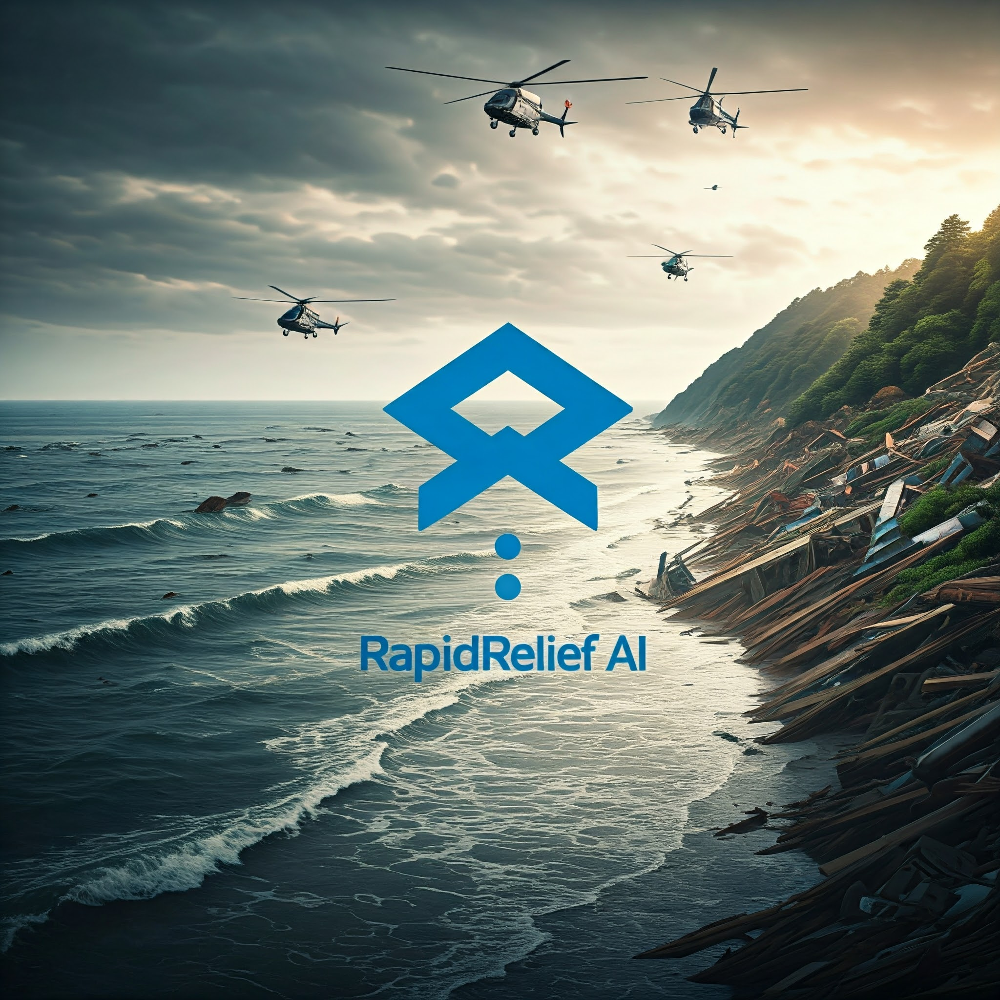

# 🚀 Major League Hacking Hackathon  
### **Best Project for Streamlit Innovation**   



---

## 📹 Live Demo
<div align="center">
  <a href="https://drive.google.com/file/d/1JL8gWuimD-GdVqNu1zLzw77Z60RqYVQc/view?usp=sharing" target="_blank">
    
    <br>
    <strong>▶ Click to Play Demo Video</strong>
  </a>
  <br>
  <sub>Opens in new tab | Google Drive</sub>
</div>

---

## 📝 **Project Description**  
This project will use generative AI to optimize and simulate resource allocation in real-time for disaster response scenarios, such as:  
- Floods  
- Wildfires  
- Earthquakes  

The AI will provide **resource distribution plans** for:  
- Food  
- Water  
- Medical kits  

Based on critical inputs:  
✔ Disaster severity  
✔ Location density  
✔ Infrastructure status  

---

## 💡 **Core Idea**  
Leverage generative models to:  
1. Simulate resource allocation  
2. Generate optimized maps/routes  
3. Account for real-world factors:  
   - Road access  
   - Population distribution  
   - Time constraints  

**Impact**: Enables faster, more efficient disaster response decisions.  

---

## 🛠 **Implementation Steps**  
**Keep all files in one location**:  
`main.py`, `data_generation.py`, `severity_calculation.py`,  
`resource_allocation.py`, `dashboard.py`, `gan_model.py`  

1. **Start MongoDB** (if not running)  
2. **Train GAN Model** (Terminal 1):  
   ```bash
   python train_gan.py
   ```  
3. **Run GAN Generator** (Same Terminal 1):  
   ```bash
   python gan_generator.py
   ```  
4. **Launch Dashboard** (Terminal 2):  
   ```bash
   streamlit run dashboard.py
   ```  
